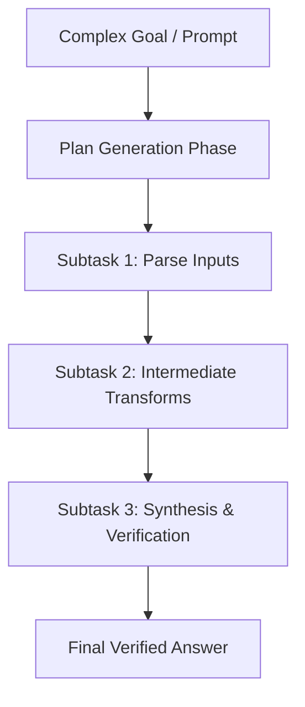

# Plan-and-Solve Hierarchical Decomposer Skill

High-efficiency, zero-dependency Python implementation of the **Plan-and-Solve (PS)** prompting and orchestration strategy for complex multi-step reasoning.

## Features
- **Explicit Hierarchical Planning**: Deconstructs convoluted requests into explicit sequential subtasks before execution.
- **Dependency Flow**: Passes completed task outputs down the pipeline to minimize hallucinations.
- **Zero External Dependencies**: Pure Python standard library.
- **Native MCP Protocol**: JSON-RPC 2.0 stdio server compatible with Claude Desktop, Cursor, and Windsurf.

## Architecture

